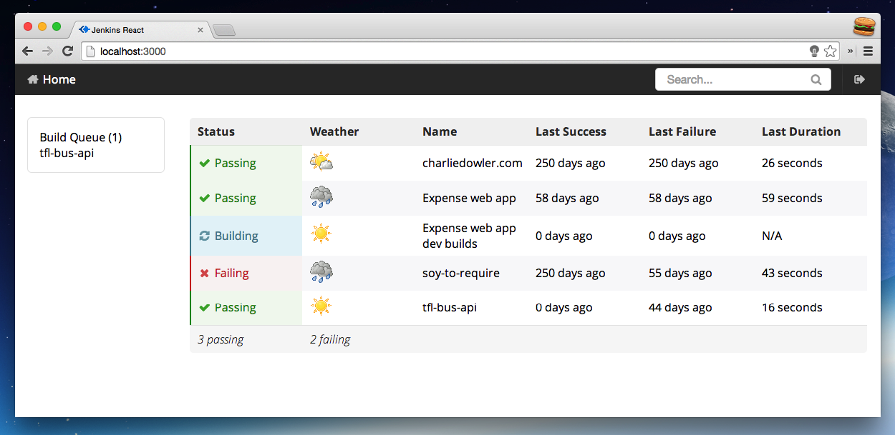

# jenkins-react (WIP)

> A nicer jenkins UI with semantic-ui + React.js



## Installation
```sh
$ git clone git@github.com:charliedowler/jenkins-react.git
$ npm install --global gulp
$ npm install
$ node bin/www # Start the server
$ gulp # Start dev mode
```

### Why?
Just a small side project messing around with React.